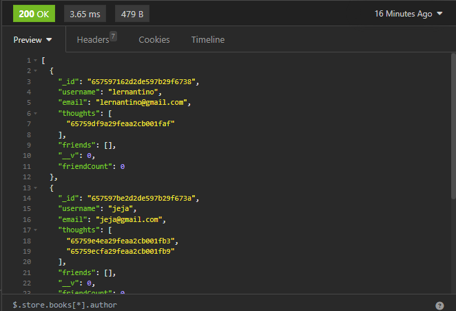

# Social-Network-API

#### by JJ Saoit 

## Preview

## Description

This is an application simulates a social network API

## Table of Contents

- [Installation](#installation)
- [Usage](#usage)
- [Credits](#credits)
- [License](#license)

## Installation

install express and mongoose

## Usage

npm start and you should be able to test routes.

## Credits

Name: JJ Saoit
E-mail: saoitjensen@gmail.com
Github: jensenjamessaoit
Colaborators: N/A

## License

This project is licensed under [MIT](https://opensource.org/license/mit/).
